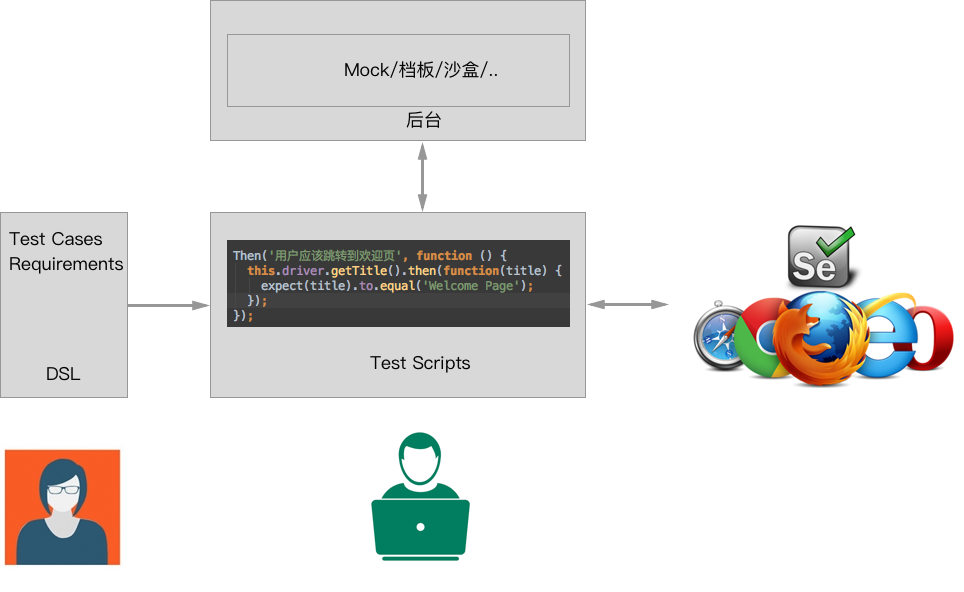
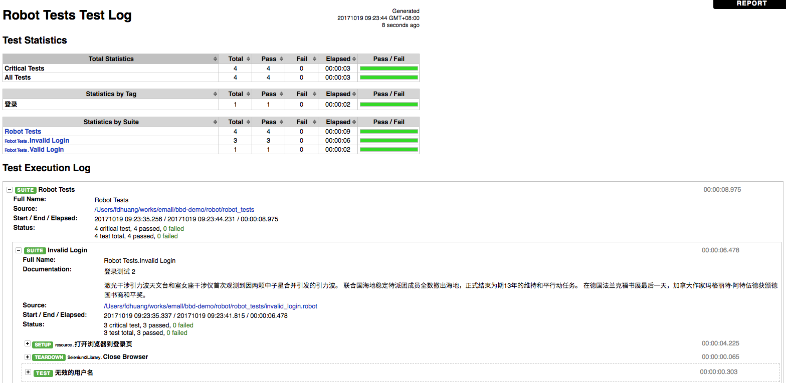
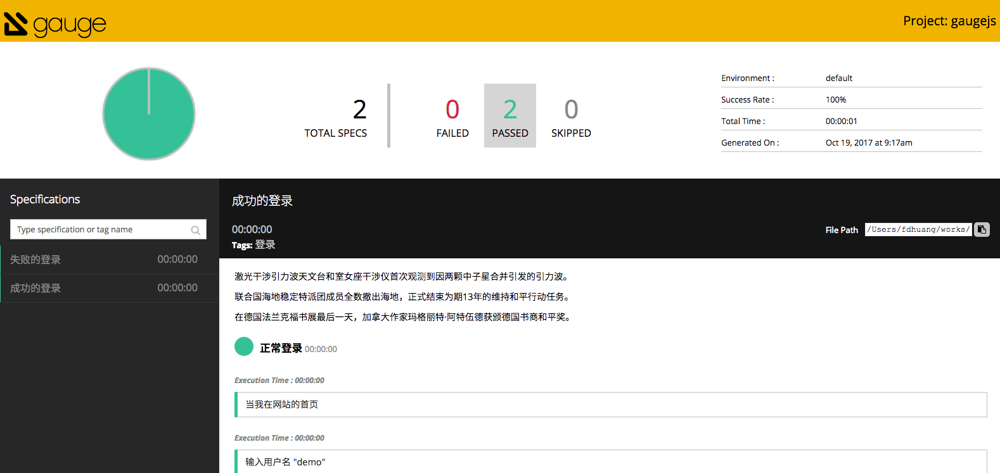

BDD 框架对比: Cucumber.js vs Robot Framework vs Gauge.js
===

Behavior Driven Development，行为驱动开发是一种敏捷软件开发的技术，它鼓励软件项目中的开发者、QA和非技术人员或商业参与者之间的协作。

> BDD 是第二代的、由外及内的、基于拉(pull)的、多方利益相关者的(stakeholder)、多种可扩展的、高自动化的敏捷方法。它描述了一个交互循环，可以具有带有良好定义的输出（即工作中交付的结果）：已测试过的软件。

> BDD的重点是通过与利益相关者的讨论取得对预期的软件行为的清醒认识。它通过用自然语言书写非程序员可读的测试用例扩展了测试驱动开发方法。行为驱动开发人员使用混合了领域中统一的语言的母语语言来描述他们的代码的目的。这让开发者得以把精力集中在代码应该怎么写，而不是技术细节上，而且也最大程度的减少了将代码编写者的技术语言与商业客户、用户、利益相关者、项目管理者等的领域语言之间来回翻译的代价。

BDD Workflow
---


BDD Process
---



COMPARE
---

 x          |  Cucumber                          |Gauge                |   Robot   
------------|------------------------------------|----------------------|-----------
编程语言支持 | Java,Ruby,JavaScript 等 13 种语言    | Java, JavaScript, Ruby 等 6 种语言 | Python, Java, C  
支持的系统   | 所有主流系统    | 所有主流系统  | 所有主流系统  
多语言支持   |  UTF-8        | UTF-8          | 用户关键字及用例层面支持UTF-8
中文社区支持 | 完善           |     待完善      |   完善   
Report     | JS 不支持 HTML  |   粗粒度          | 细粒度 
失败时截图   | 不支持         |   支持          | 支持

Cucumber.js
--

> Cucumber 是一个能够理解用普通语言 描述的测试用例的支持行为驱动开发（BDD）的自动化测试工具，用Ruby编写，支持Java和.Net等多种开发语言。
  
 - 使用自然语言，更易读
 - 支持表格参数
 - 支持多种格式的Report：html、junit etc.
 - 支持多种语言
 - 支持四种状态的测试步骤：Passed、Failed、Skipped、Pending
 - 支持使用变形器消除重复
 - 一个商用的在线 Cucumber 系统：Cucumber Pro

### DSL Code Examples

示例代码：[https://github.com/phodal/bdd-frameworks-compare/tree/master/cucumber](https://github.com/phodal/bdd-frameworks-compare/tree/master/cucumber)

```cucumber
# language: zh-CN
功能: 失败的登录

  场景大纲: 失败的登录
    假设 当我在网站的首页
    当 输入用户名 <用户名>
    当 输入密码 <密码>
    当 提交登录信息
    那么 页面应该返回 "Error Page"

    例子:
      |用户名     |密码      |
      |'Jan1'    |'password'|
      |'Jan2'    |'password'|
```

### Step Code Examples

```javascript
defineSupportCode(function({Given, When, Then}) {
    Given('当我在网站的首页', function() {
        return this.driver.get('http://0.0.0.0:7272/');
    });

    When('输入用户名 {string}', function (text) {
        return this.driver.findElement(By.id('username_field')).sendKeys(text)
    });

    When('输入密码 {string}', function (text) {
        return this.driver.findElement(By.id('password_field')).sendKeys(text)
    });

    When('提交登录信息', function () {
        return this.driver.findElement(By.id('login_button')).click()
    });

    Then('页面应该返回 {string}', function (string) {
      this.driver.getTitle().then(function(title) {
        expect(title).to.equal(string);
      });
    });
});
```

Robot Framework
---

> Robot Framework是一款python编写的功能自动化测试框架。具备良好的可扩展性，支持关键字驱动，可以同时测试多种类型的客户端或者接口，可以进行分布式测试执行。 

关键特性：

 - 使用关键字的机制，更容易上手
 - 提供了RIDE，对于不熟悉编码的人来说比较友好
 - 能够精细的控制关键字的scope
 - Log 和 Report 非常好
 - 使用变量文件的机制来描述不同的环境
 - 丰富的关键字库
 - 内置变量

### DSL Code Examples

示例代码：[https://github.com/phodal/bdd-frameworks-compare/tree/master/robot](https://github.com/phodal/bdd-frameworks-compare/tree/master/robot)

```robot
*** Settings ***
Documentation     登录测试 2
...
Suite Setup       打开浏览器到登录页1
Suite Teardown    Close Browser
Test Setup        转到登录页
Test Template     使用错误的失败凭据应该登录失败
Resource          resource.robot

*** Test Cases ***               USER NAME        PASSWORD
无效的用户名                      invalid          ${VALID PASSWORD}
无效的密码                        ${VALID USER}    invalid
无效的用户名和密码                 invalid          whatever

*** Keywords ***
使用错误的失败凭据应该登录失败
    [Arguments]    ${username}    ${password}
    输入用户名    ${username}
    输入密码    ${password}
    提交登录信息
    登录应该不成功

登录应该不成功
    Location Should Be    ${ERROR URL}
    Title Should Be    Error Page
```


### Step Code Examples

```robot
打开浏览器到登录页
    Open Browser    ${LOGIN URL}    ${BROWSER}
    Maximize Browser Window
    Set Selenium Speed    ${DELAY}
    Login Page Should Be Open

Login Page Should Be Open
    Title Should Be    Login Page

转到登录页
    Go To    ${LOGIN URL}
    Login Page Should Be Open

输入用户名
    [Arguments]    ${username}
    Input Text    username_field    ${username}

输入密码
    [Arguments]    ${password}
    Input Text    password_field    ${password}

提交登录信息
    Click Button    login_button

应该跳转到欢迎页
    Location Should Be    ${WELCOME URL}
    Title Should Be        Welcome Page
```

### 报告示例

[点击查看示例](./report_examples/robot_report.html)



Gauge
---

> Gauge 是 Go 开发的一个跨平台测试自动化工具。它给作者提供了用商业语言测试用例的能力。

关键特性：

 - 基于 markdown 的丰富的标记
 - 支持用任何程序语言来编写测试代码
 - 支持 plugin 的模块化架构
 - 跨语言实现一致性。
 - 简单，灵活和丰富的语法
 - 开源的，因此它可以自由共享，同时被他人改进
 - 商业语言测试 : 支持可执行文件的概念
 - 帮助您创建可维护和可理解的测试套件
 - 支持外部数据来源
 - IDE Support

### DSL Code Examples

示例代码：[https://github.com/phodal/bdd-frameworks-compare/tree/master/gaugejs](https://github.com/phodal/bdd-frameworks-compare/tree/master/gaugejs)

```markdown
失败的登录
===

     |用户名   |密码     |
     |--------|--------|
     |Jan1    |password|
     |Jan2    |password|

失败的登录
-----------
* 当我在网站的首页
* 输入用户名 <用户名>
* 输入密码 <密码>
* 提交登录信息
* 页面应该返回 "Error Page"
```

### Step Code Examples

```javascript
step("当我在网站的首页", async function () {
  await page.goto('http://0.0.0.0:7272/');
});

step("输入用户名 <query>", async function (query) {
  await page.click('#username_field');
  await page.type(query)
});

step("输入密码 <query>", async function (query) {
  await page.click('#password_field');
  await page.type(query)
});

step("提交登录信息", async function () {
  await page.click('#login_button')
});

step("页面应该返回 <query>", async function(query){
  await page.waitFor('h1');
  const text = await await page.$eval('#container h1', h1 => {
    return h1.innerHTML;
  });

  expect(text).to.equal(query);
});

```

### 报告示例

[点击查看示例](./report_examples/gauge_report/index.html)



SETUP
===

Requirements: Java 8, Node.js 8

```
git clone https://github.com/phodal/bdd-frameworks-compare
```

Cucumber.js
---

代码：[https://github.com/phodal/bdd-frameworks-compare/tree/master/cucumber](https://github.com/phodal/bdd-frameworks-compare/tree/master/cucumber)

1.安装

```
cd cucumber
yarn install
```

2.测试

```
npm test
```


Robot Framework
---

代码：[https://github.com/phodal/bdd-frameworks-compare/tree/master/robot](https://github.com/phodal/bdd-frameworks-compare/tree/master/robot)

1.安装依赖

```
pip install -r requirements.txt
```

2.测试

```
robot robot_tests
```

Gauge
---

代码：[https://github.com/phodal/bdd-frameworks-compare/tree/master/gaugejs](https://github.com/phodal/bdd-frameworks-compare/tree/master/gaugejs)

### Gauge Puppeteer

1.安装 Gauge

```
brew install gauge
```

2.执行安装

```
yarn install
```

### Gauge.js

代码：[https://github.com/phodal/bdd-frameworks-compare/tree/master/others/gaugejs](https://github.com/phodal/bdd-frameworks-compare/tree/master/others/gaugejs)

1.安装 Gauge

```
brew install gauge
```

2.执行安装

```
yarn install
```

3.安装 local 版 selenium

```
selenium-standalone install
```

4.Terminal 1:

```
selenium-standalone start
```

5.Terminal 2:

```
npm test
```

其它
---

### Gauge 笔记

```
$ gauge init -t

ruby_selenium
ruby
python
js_webdriver
js_puppeteer
js
java_maven_selenium
java_maven
java
go_agouti
csharp

Run `gauge init <template_name>` to create a new Gauge project.
```
